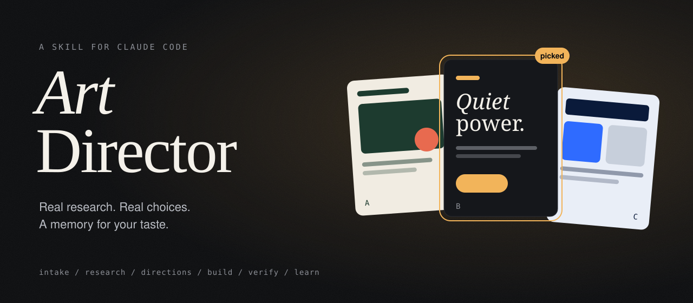
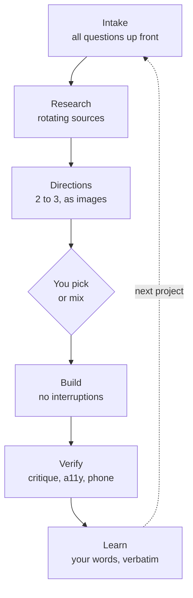
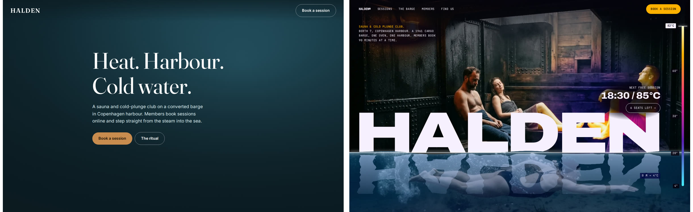
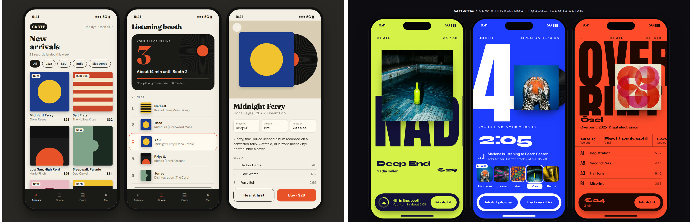
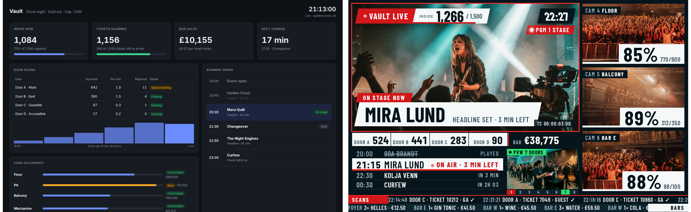

<p align="center">
  
</p>

<p align="center">
  <b>Stop getting the same AI-looking page every time.</b><br>
  A Claude Code skill that works like a good art director: it asks first, researches for real,
  lets you choose, and remembers what you liked.
</p>

<p align="center">
  
</p>

<p align="center">
  <a href="#install">Install</a> ·
  <a href="#how-it-works">How it works</a> ·
  <a href="#with-and-without">With and without</a> ·
  <a href="#your-taste-profile">Taste profile</a> ·
  <a href="#faq">FAQ</a>
</p>

---

## The problem

Ask any coding agent for a "premium landing page" and you get the same page.
Purple gradient. Big numbers in tiles. Three feature columns. Pricing cards. FAQ accordion.
It is not bad. It is just average, because the model falls back to the average of everything it has seen.

Style guides and "make it look good" prompts help a little. What actually fixes it is what a
human designer does: understand the brief, go look at real work, show options, let the client pick,
and learn from the client's reaction.

**Art Director turns that process into a skill.**

## How it works



| Step | What happens | Why it matters |
|---|---|---|
| **Intake** | One round of questions: audience, mood, light or dark, brand colors, the one memorable element, device, taboos. | You answer once. No "quick question" in the middle of the build. |
| **Research** | 3 to 4 inspiration sources, rotated against the log of past projects. Real products next to your category, not just gallery front pages. | The single biggest cause of samey output is using the same two favorite galleries. |
| **Directions** | 2 to 3 clearly different directions, each rendered as an actual image with real imagery and its core motion, with sources, fonts, colors and floor plan named. A product gets a screen list to approve too. | You react to pictures, not to adjectives. "Colors from A, layout from B" is a valid answer. |
| **Build** | The chosen direction gets built end to end. Open questions are decided in its spirit and listed at the end. | Flow for the agent, no babysitting for you. |
| **Verify** | Design critique, accessibility and contrast audit, desktop and phone screenshots, your standing rules. | "Done" means looked at, not just compiled. |
| **Learn** | Your praise and criticism go into your taste profile, word for word. | Project five starts where project four ended. |

It also works unattended. In scheduled or background runs it asks nothing, sketches the directions
and stops there with a recommendation, so you pick before anything gets built.

## With and without

Same brief, same model. Left: plain Claude Code, no skills. Right: Art Director with a fresh, empty
taste profile. It researched, sketched three directions, a human picked one, then it built.
Each folder has the HTML to open, a short screen capture and all three sketched directions.

**Website: Halden, a sauna club on a barge in Copenhagen harbour.**
Picked: a mix of "thermal" and "waterline". Heat above the water, the plunge below, a temperature scale that runs with the scroll.



[Capture](examples/website/with/index.mp4) · [Directions](examples/website/directions.jpg) · [Notes](examples/website/with/NOTES.md) · [HTML](examples/website/)

**App: Crate, the phone companion of an independent record shop.**
Picked: "Flood". Every record takes over the screen with its own colour and a giant cropped name.



[Capture](examples/app/with/index.mp4) · [Directions](examples/app/directions.jpg) · [Notes](examples/app/with/NOTES.md) · [HTML](examples/app/)

**Dashboard: Vault, show night at a 1,500-capacity venue, on the office wall.**
Picked: "Live Gallery". The night as a TV control room: program monitor, zone cameras, tally lights, rundown, tickers.



[Capture](examples/dashboard/with/index.mp4) · [Directions](examples/dashboard/directions.jpg) · [Notes](examples/dashboard/with/NOTES.md) · [HTML](examples/dashboard/)

Images in the right-hand builds are generated. The first round of these examples was built without
images and without motion, and was rejected as "too generic". That is the skill working as intended:
the reaction went into the taste profile and the next round started from it.

## Install

**As a plugin (recommended, gets updates):**

```
/plugin marketplace add crizex/art-director
/plugin install art-director@art-director
```

**As a plain skill:**

```bash
git clone https://github.com/crizex/art-director /tmp/art-director
cp -r /tmp/art-director/skills/art-director ~/.claude/skills/
```

Then just ask for design work. The skill triggers on redesigns, new pages and screens,
"premium", "high end", "make it prettier", and on screenshots you send as a reference.

## Your taste profile

Your taste is yours, so it lives outside the plugin and survives every update:

```
~/.claude/art-director/
├── taste.md          what you liked and disliked, in your own words
├── log.md            which sources were used on which project
├── sources.md        optional: your own inspiration sources
├── setup.md          optional: your machine, accounts, tool paths, house rules
├── references/       screenshots you collected, with index.md
└── drafts/           optional: direction sketches worth keeping
```

The skill creates it on first use. A few weeks in, `taste.md` reads like a brief no one had to write:

```markdown
## Liked
| Date       | What                                   | Their words                          |
|------------|----------------------------------------|--------------------------------------|
| 2026-03-02 | Dark hero, one warm light, serif title | "exactly what I mean by premium"     |

## Disliked
| Date       | What                                   | Their words                          |
|------------|----------------------------------------|--------------------------------------|
| 2026-03-09 | Standard SaaS sections below the hero  | "the top is great, below it feels AI" |

## Standing rules
- Client work: keep the brand palette, rethink the building blocks.
- The metaphor belongs on the marketing site. The tool itself stays sober.
```

Tip: make `~/.claude/art-director` a symlink into a git repo and your taste gets version history for free.

**Collecting references:** see something good on Instagram, Dribbble or anywhere else?
Screenshot it, send it to Claude with "remember this" and a word about what matters.
It lands in `references/` with your comment, and the next project uses it.
Your own finds always outweigh any gallery.

## Works even better with

Art Director is the conductor. It uses these when they are installed and skips them when they are not:

- **[ui-ux-pro-max](https://github.com/nextlevelbuilder/ui-ux-pro-max-skill)** for industry palettes, font pairings and anti-patterns (treated as the default to beat).
- **[impeccable](https://github.com/pbakaus/impeccable)** or **hallmark** for AI-slop critique and detection.
- **[web-design-guidelines](https://github.com/vercel-labs/agent-skills)** for the accessibility and performance audit.
- **Playwright** or any real browser, so JavaScript-heavy galleries can actually be seen. With Playwright and ffmpeg, `scripts/record.mjs` records animated references and sketches as video plus a contact sheet.
- **An image model** (any CLI that writes a PNG) for photos, products and mascots in the sketches.

## What is in the box

```
skills/art-director/
├── SKILL.md          the process
├── sources.md        30+ curated inspiration sources by category, with access notes
├── scripts/
│   ├── record.mjs         records a page as video plus contact sheet (optional, needs Playwright and ffmpeg)
│   └── check-sources.mjs  flags dead, moved and blocked inspiration sources (Node 18+)
└── templates/        starting files for your taste profile
```

No telemetry, no network calls beyond the pages you ask it to look at. It is instructions, a source list
and two optional helper scripts.

## FAQ

**Does it slow things down?**
The first project takes one extra round: questions, then a pick between directions.
That round replaces the three rounds of "no, not like that" it saves you later.

**I just want it to build, no questions.**
Put everything in the first message (audience, mood, colors, what must stay). The skill only asks
what the brief leaves open. For zero questions, say so, or run it as a background job.

**Does it store anything about me?**
Only what you say about designs, in plain Markdown files in your home folder.
Nothing leaves your machine through this skill.

**Why "verbatim"?**
Because "the top is great, below it feels AI" is a better instruction than any summary of it.
Paraphrasing loses exactly the nuance that makes taste taste.

## Changelog

See [CHANGELOG.md](CHANGELOG.md) or the [releases](https://github.com/crizex/art-director/releases).

## License

MIT

Not affiliated with Anthropic. Claude is a trademark of Anthropic.
